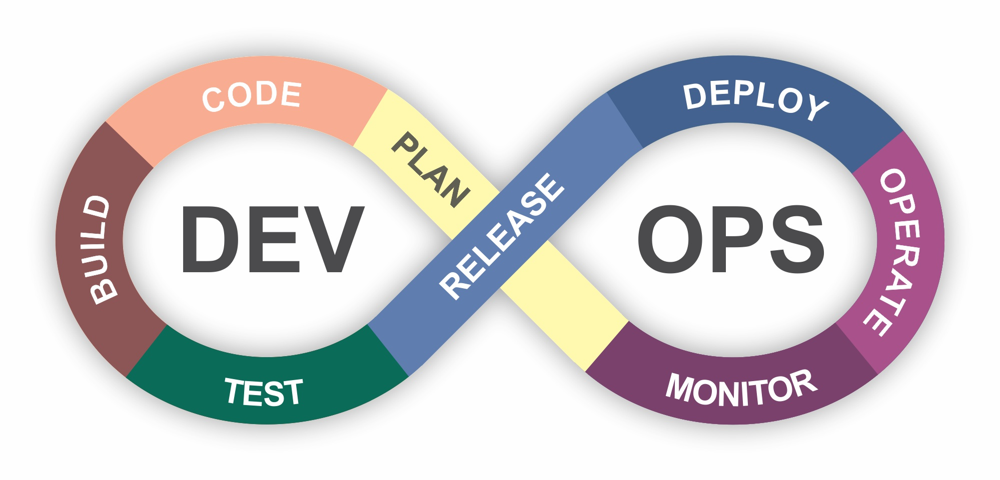
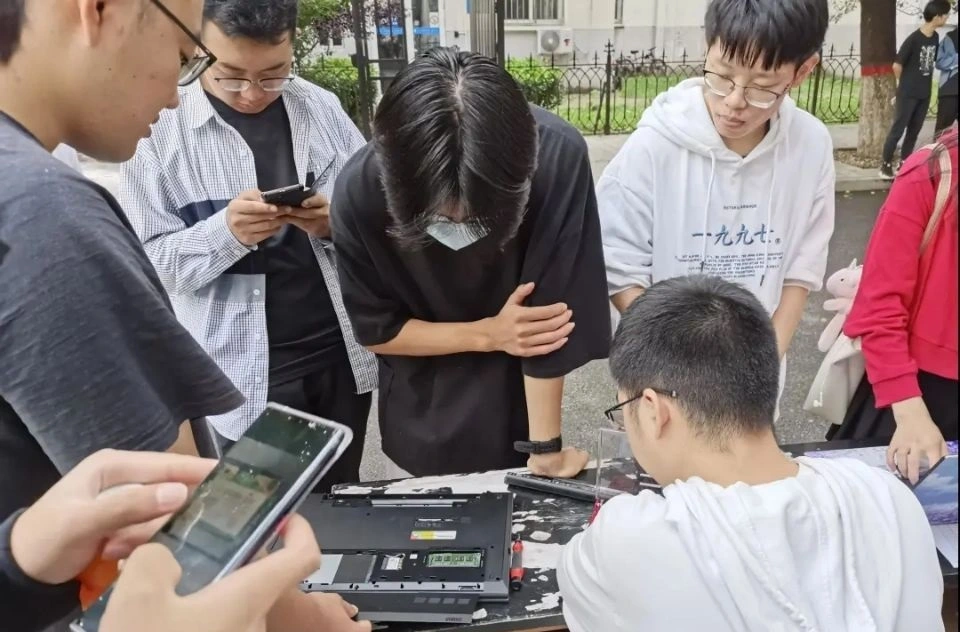
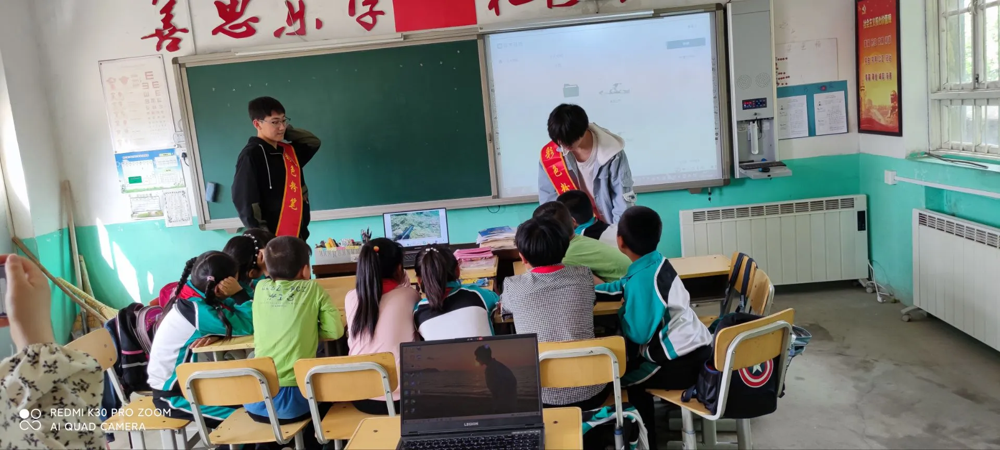
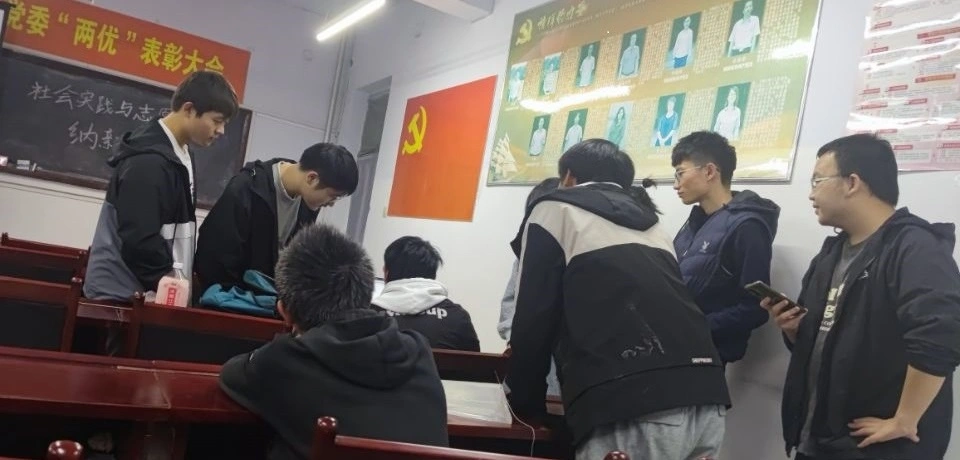
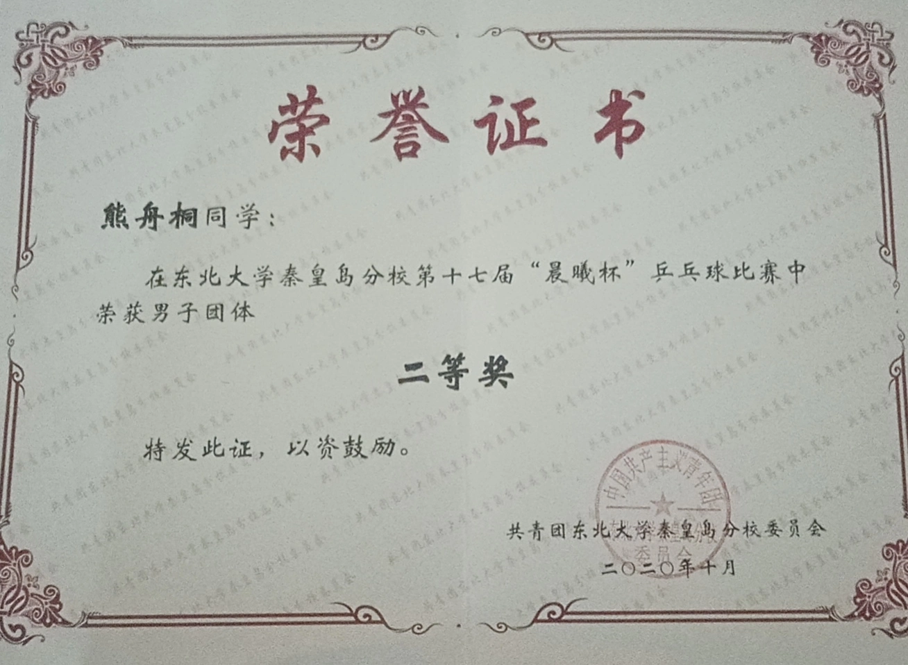
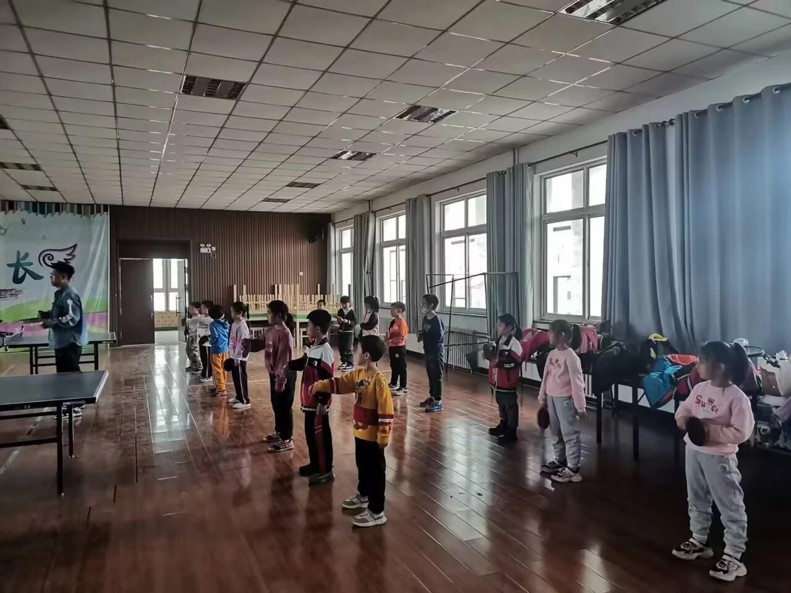
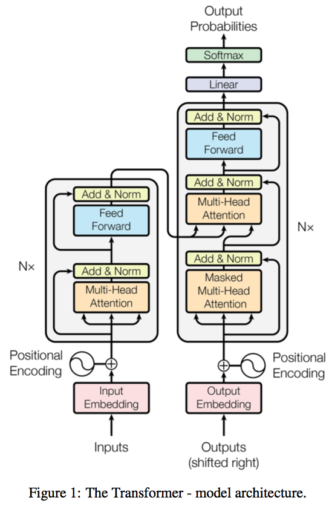
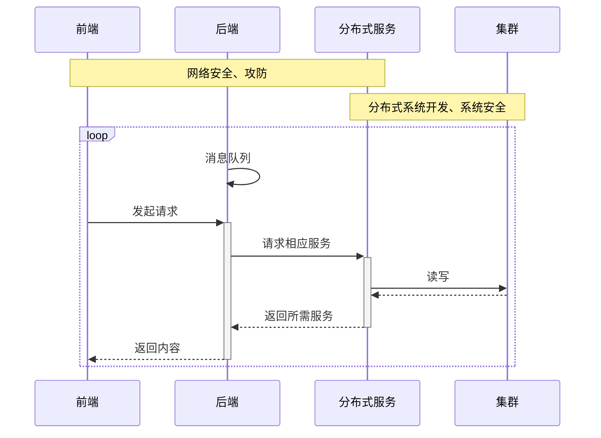
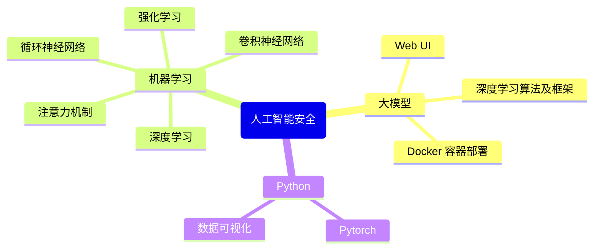

# 熊舟桐


<div class="pt-12">
  <span @click="$slidev.nav.next" class="px-2 py-1 rounded cursor-pointer" hover="bg-white bg-opacity-10">
    东北大学秦皇岛分校 - 计算机科学与技术
    <!--<carbon:arrow-right class="inline"/>-->
  </span>
</div>


<div class="abs-br m-6 flex gap-2">
  <button @click="$slidev.nav.openInEditor()" title="Open in Editor" class="text-xl slidev-icon-btn opacity-50 !border-none !hover:text-white">
    <carbon:edit />
  </button>
  <a href="https://github.com/canoe95" target="_blank" alt="GitHub"
    class="text-xl slidev-icon-btn opacity-50 !border-none !hover:text-white">
    <carbon-logo-github />
  </a>
</div>

<!--
The last comment block of each slide will be treated as slide notes. It will be visible and editable in Presenter Mode along with the slide. [Read more in the docs](https://sli.dev/guide/syntax.html#notes)
-->

---
transition: fade-out
---

# 进程一览

A sample PCB of my study life in NEUQ

- 📝 **大一**
  - 初识计算机，入门 C/C++、STL 以及图形编程
  - 加入2084工作室，自学 Java、前端及数据库相关技术，能够熟练编写 JSP 程序
  - 拥有第一台服务器（CentOS）
- 🧑‍💻 **大二**
  - 养成博客记录的习惯，能够熟练使用前后端框架及相应中间件设计、编写、分离部署Web程序
  - 开始组队参加软件开发类比赛，最好成绩为省二等奖
- 🛠 **大三**
  - 已修大部分专业课，使用 Linux（Manjaro）作为主力机
  - 参加中国大学生计算机设计大赛Web开发类，获国家三等奖
- 🤹 **大四**
  - 备考西电网络与信息安全专业

<a herf="https://canoe4.github.io" style="float: right;">Read more about me</a>

<!--
You can have `style` tag in markdown to override the style for the current page.
Learn more: https://sli.dev/guide/syntax#embedded-styles
-->

<style>
h1 {
  background-color: #2B90B6;
  background-image: linear-gradient(45deg, #4EC5D4 10%, #146b8c 20%);
  background-size: 100%;
  -webkit-background-clip: text;
  -moz-background-clip: text;
  -webkit-text-fill-color: transparent;
  -moz-text-fill-color: transparent;
}
</style>
<!--
Here is another comment.
-->

---
layout: default
---

# 目录

```
Directory ———— 按 o 浏览缩略图
```

<br>

<Toc></Toc>

---

# 优秀课程

The Courses I Have Learned

| 课程                    | 成绩    | 掌握程度                                           |
| ----------------------- | ------- | -------------------------------------------------- |
| C++ 程序设计            | 90      | 熟悉 STL，会基本的图形编程                         |
| 高等数学B(一) / (二)    | 94 / 93 | 良好的逻辑思维                                     |
| Java 程序设计           | 97      | 能熟练开发后端 API，了解 JUC 并发编程              |
| Web 开发与应用          | 92      | 能独立使用 HTML/CSS/JS、Vue、Electron 开发前端页面 |
| 计算机网络课程设计      | 95      | 熟悉 Java Socket 及 WebSocket 编程                 |
| Linux操作系统及内核分析 | 88      | 熟悉 Linux 基本命令，能手动部署各种服务器环境      |


<kbd style="float:right"><a href="./assets/grade.pdf">点此浏览完整成绩单</a></kbd>

---

# 技能清单

The Technology I Have Learned

<div grid="~ cols-2 gap-4">


<div>


后端开发

- 语言：Java、Python、C++
- 框架：SpringBoot、MyBatis

前端开发

- 语言：HTML/CSS/JS、TypeScript
- 框架：Vue、Element-UI、Electron

运维

- 服务器：Linux、Nginx、Tomcat
- 中间件：MySQL、Redis、Docker、RabbitMQ
- 工具与文档：Git、Markdown

</div>

<div>




<div class="w-60 relative mt-6">  
  <div class="relative w-40 h-40">
    
    
    
  </div>
  <div
    class="text-5xl absolute top-9 left-42 text-[#2B90B6] -z-1"
    v-motion
    :initial="{ x: -80, opacity: 0}"
    :enter="{ x: 0, opacity: 1, transition: { delay: 2000, duration: 1000 } }">
    Full Stack Developer
  </div>


</div>
</div>
</div>

<!-- vue script setup scripts can be directly used in markdown, and will only affects current page -->

<script setup lang="ts">
const final = {
  x: 0,
  y: 0,
  rotate: 0,
  scale: 1,
  transition: {
    type: 'spring',
    damping: 10,
    stiffness: 20,
    mass: 2
  }
}
</script>
<div
  v-motion
  :initial="{ x:770, y: 400, opacity: 0}"
  :enter="{ y: 0, opacity: 1, transition: { delay: 3500 } }">
<a herf="https://sli.dev/guide/animations.html#motion"></a>


</div>

---

# 软件产出

Code products during NEUQ

| 项目名称                            | 简述                                                  | Github 链接                                                  |
| ----------------------------------- | ----------------------------------------------------- | ------------------------------------------------------------ |
| <kbd>基于Docker的在线判题系统</kbd> | Online Judge 平台，获中国大学生计算机设计大赛省二等奖 | [Bears-OJ](https://github.com/canoe4/Bears-OJ)               |
| <kbd>基于ChatGLM的远程AI助手</kbd>  | 远程大模型助手，获中国大学生计算机设计大赛国家三等奖  | [Shadow](https://github.com/canoe4/Shadow)                   |
| <kbd>基于Redis的远程CMD</kbd>       | 基于 Redis 的远程主机控制程序，由Web端和监听器组成    | [Remote-Controller-2.0](https://github.com/canoe4/Remote-Controller-2.0) |
| <kbd>基于Socket的远程CMD</kbd>      | 基于套接字的远程关机程序，由Web端和监听器组成         | [Remote-Controller-1.0](https://github.com/canoe4/Remote-Controller-1.0) |
| <kbd>我的博客</kbd>                 | 基于 VuePress 的单页面应用                            | [canoe95.github.io](https://canoe4.github.io)                |
| <kbd>击剑火柴人</kbd>               | 双人小游戏，C++ 图形编程                              | [Fencing-Matchman](https://github.com/canoe4/Fencing-Matchman) |

<kbd style="float:right">下一页 ——></kbd>

---

| 项目名称                         | 简述                                           | Github 链接                                                  |
| -------------------------------- | ---------------------------------------------- | ------------------------------------------------------------ |
| <kbd>邮件收发系统</kbd>          | 网页邮箱系统，Java JUC 编程多线程控制邮件发送  | [PostOffice](https://github.com/canoe4/PostOffice)           |
| <kbd>成绩管理系统</kbd>          | 基于 Springboot、MyBatis 的成绩管理系统        | [Performance-Analysis-System](https://github.com/canoe4/Performance-Analysis-System) |
| <kbd>微型论坛系统</kbd>          | 基于 JSP 的论坛网页                            | [NEUQHelper](https://github.com/canoe4/NEUQHelper)           |
| <kbd>编译器前端</kbd>            | 词法分析器和语法分析器，由 Flex/Bison 实现     | [Compile-Experiment](https://github.com/canoe4/Compile-Experiment) |
| <kbd>基于 C 的 Lisp 编译器</kbd> | 《Build Your Own Lisp》                        | [MyLisp](https://github.com/canoe4/MyLisp)                   |
| <kbd>ChatGPT的桌面应用</kbd>     | ChatGPT的桌面应用，客户端 Electron，后端 Flask | [ChatGPT-Electron](https://github.com/canoe4/ChatGPT-Electron-App) |
| <kbd>简易的分类器训练</kbd>      | 一些 SKLearn 和 PyTorch 的机器学习实例         | [ML-Experiment](https://github.com/canoe4/ML-Experiment)     |

&nbsp;&nbsp;[More](https://canoe4.github.io/Pages)

---

# 学生工作

院志愿实践部副主任

<div style="display:inline-block;width=100px">
  <p>负责部门日常值班活动的组织、公众号的管理和</p>
  <p>排班等工作，参与<a href="https://canoe7.netlify.app/">部门博客</a>的搭建和维护。e 管</p>
  <p>家志愿服务项目获<a href="http://news.neuq.edu.cn/info/1282/30249.htm">省大学生志愿服务十佳项目</a></p><br>
  
</div>

<div style="display:inline-block;float:right">
	<br>
    
</div>

<arrow v-click="1" x1="950" y1="310" x2="712" y2="435" color="#564" width="3" arrowSize="1" />


---

# 文体艺术

<div grid="~ cols-2 gap-4">
<div>
<span style="font-size:14px">校乒乓球队队员，男单前八，篮球新生杯随队获院亚军</span>



<span style="font-size:14px">课余自学吉他</span>

<audio controls>
  <source src="./assets/baiyang.mp3" type="audio/mpeg">
</audio>

</div>

<div>

```html
大三时在球馆兼职助教，教小朋友打球
每周四会和教练去球馆附近的小学带一节文体活动课
```



</div>
</div>

<!--
Presenter note with **bold**, *italic*, and ~~striked~~ text.

Also, HTML elements are valid:
<div class="flex w-full">
  <span style="flex-grow: 1;">Left content</span>
  <span>Right content</span>
</div>
-->


---
class: px-20
---

# 部分代码实现

《Attention Is All You Need》

<div grid="~ cols-2 gap-4">

<div>





</div>

<div>

代码复现：Transformer 模型编码器

- 输入嵌入层
- 位置编码
- 多头自注意力层
- 层归一化
- 前馈神经网络

参考：

【1】[Coding a Transformer from scratch on PyTorch, with full explanation, training and inference-YouTube](https://www.youtube.com/watch?v=ISNdQcPhsts)

【2】[A PyTorch implementation of the Transformer model in "Attention is All You Need"](https://github.com/jadore801120/attention-is-all-you-need-pytorch)


</div>

</div>

---


<div grid="~ cols-2 gap-9">


<div>


输入嵌入层：获取句子输入处理为 512 维的向量，即 d_model

```python
'''输入器'''
class InputEmbeddings(nn.Module):

    def __init__(self, d_model: int, vocab_size: int):
        super().__init__()
        self.d_model = d_model
        self.vocab_size = vocab_size
        self.embedding = nn.embedding(vocab_size, d_model)


    def forward(self, x):
        return self.embedding(x) * math.sqrt(self.d_model)
```

通过 torch.nn 直接构建从句子长度（vocab_size）到所需向量（d_model）的嵌入层，同时，论文中把 √d_model 作为该层的权重与之相乘

</div>

<div>


位置编码：对输入嵌入生成的向量进行位置编码
$$
PE(pos,i) = 
\left\{
\begin{matrix}
\sin\frac{pos}{10000^{\frac{i}{d_{model}}}}&i为偶数\\\\
\cos\frac{pos}{10000^{\frac{i}{d_{model}}}}&i为奇数
\end{matrix}
\right.
$$

```python
'''创建矩阵'''
pe = torch.zeros(seq_len, d_model)

'''如何构建向量'''
position = torch.arange(0, seq_len, dtype=torch.float).unsqueeze(1)
div_term = torch.exp(torch.arange(0, d_model, 2).float) * (-math.log(10000.0) / d_model)

'''sin 函数对偶数处理'''
pe[:, 0::2] = torch.sin(position * div_term)
'''cos 函数对奇数处理'''
pe[:, 1::2] = torch.cos(position * div_term)
pe = pe.unsqueeze(0)
```

transformer 模型通过位置编码来捕获输入序列中的位置信息，使模型能够理解词语在序列中的位置关系

</div>

</div>


---

<div grid="~ cols-2 gap-9">

<div>

层归一化处理
$$
\hat{x_j}=\frac{x_j-\mu_j}{\sqrt{\sigma_j^2+\epsilon}}
$$
加一个 ε 是为了防止 σ 过于贴近 0

```python
class LayerNormalization(nn.Module):

    def __init__(self, eps: float = 10**-6) -> None:
        super().__init__()
        self.eps = eps
        self.alpha = nn.Parameter(torch.ones(1))
        self.bias == nn.Parameter(torch.zeros(1))

    def forward(self, x):
        mean = x.mean(dim = -1, keepdim = True)
        std = x.std(dim = -1, keepdim = True)
        return self.alpha * (x-mean) / (std + self.eps)
```

层归一化对每个神经层的输入数据进行归一化处理，使其分布更加稳定和一致，以提高神经网络的尺度不变性，避免梯度消失

</div>


<div>

前馈网络（Position-wise Feed-Forward Networks）
$$
FFN(x) = max(0,xW_1+b_1)W_2+b_2
$$
输入的`d(model) = 512`并且`d(ff) = 2048`，即向量长度要从 512 构建到 2048

```python
class FeedFordwardBlock(nn.Module):
    def __init__(self, d_model: int, d_ff: int, dropout: float) -> None
        super().__init__()
        self.linear_1 = nn.Linear(d_model, d_ff) # w1 和 b1
        self.dropout = nn.Dropout(dropout)
        self.linear_2 = nn.Linear(d_ff, d_model) # w2 和 b2
    
    def forward(self, x):
        # 张量的转换：d_model -> d_ff -> d_model
        return self.linear_2(self.dropout(torch.relu(self.linear_1(x))))
```

同样利用 torch.nn 直接构建该神经网络的线性层

</div>

</div>

---

<div grid="~ cols-2 gap-7">

<div>

多头自注意力层：最重要的模块，得到编码器的输入**并使用它三次**，分别为查询、键和值，对应之前提到的注意力公式中的三个重要参数（相当于相同的输入，应用了三次）

注意力公式
$$
Attention(Q,K,V) = softmax(\frac{QK^T}{\sqrt{d_k}})V
$$
代码实现

```python
class MultiHeadAttentionBlock(nn.Module):
    def __init__(self, d_model: int, h: int, dropout: float) -> None:
        super().init()
        self.d_model = d_model
        self.h = h
        assert d_model % h == 0, "d_model is not divisible by h"
        self.d_k = d_model // h
        self.w_q = nn.Linear(d_model, d_model) # Wq 查询
        self.w_k = nn.Linear(d_model, d_model) # Wk 键
        self.w_v = nn.Linear(d_model, d_model) # Wv 值
```


</div>

<div>


```python
        self.w_o = nn.Linear(d_model, d_model) # Wo 注意力输出
        self.dropout = nn.Dropout(dropout)
        
    # 计算我们想要的注意力分数
    @staticmethod
    def attention(query, key, value, mask, dropout: nn.Dropout):
        d_k = query.shape[-1]
        attention_scores = (query @ key.transpose(-2, -1)) / math.sqrt(d_k)
        if mask is not None:
            attention_scores.masked_fill_(mask == 0, -1e9)
        attention_scores = attention_scores.softmax(dim = -1)
        if dropout is not None:
            attention_scores = dropout(attention_scores)
        return (attention_scores @ value), attention_scores

    def forward(self, q, k, v, mask): # 矩阵处理，令三个查询的矩阵和 d_k 相关
        query = self.w_q(q)
        key = self.w_k(k)
        value = self.w_v(v)
        query = query.view(query.shape[0], query.shape[1], self.h, self.d_k).transpose(1, 2)
        key = key.view(key.shape[0], key.shape[1], self.h, self.d_k).transpose(1, 2)
        value = value.view(value.shape[0], value.shape[1], self.h, self.d_k).transpose(1, 2)
        x, self.attention_scores = MultiHeadAttentionBlock.attention(query, key, value, mask, self.dropout)
        # (batch, h, Seq_Len, d_k) --> (batch, Seq_Len, h, d_k) --> (batch, Seq_Len, d_model)
        x = x.transpose(1, 2).contiguous().view(x.shape[0], -1, self.h * self.d_k)
        return self.w_o(x)
```


</div>

</div>

---


# 未来展望

Some Technology I Want to Acquire in The Furture

<div class="grid grid-cols-2 gap-10 pt-4 -mb-6">







</div>

---
layout: center
class: text-center
---

# 感谢观看

Thanks for reading
