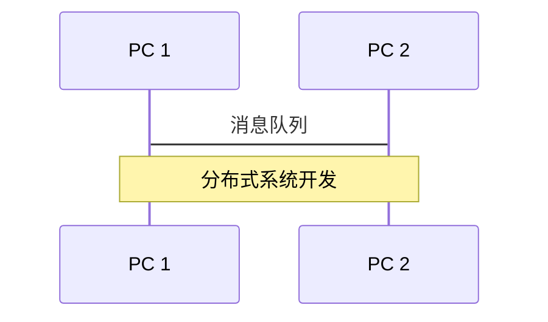
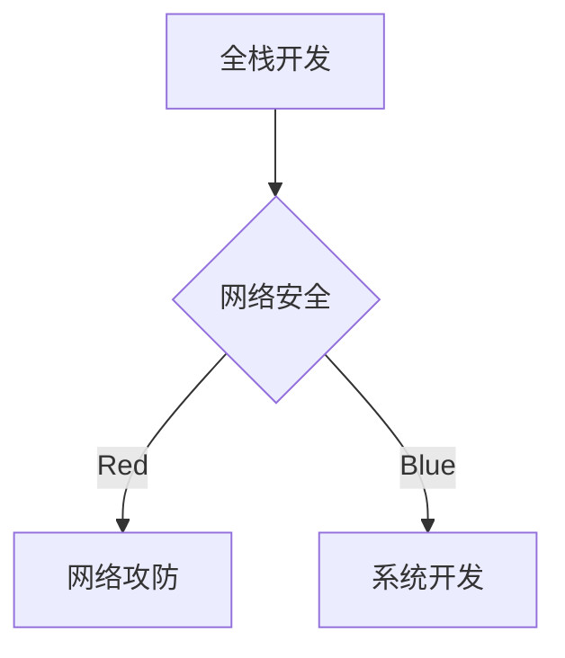
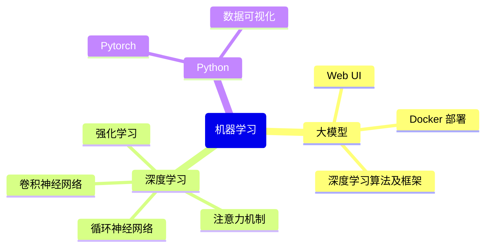

---
# try also 'default' to start simple
theme: seriph
# random image from a curated Unsplash collection by Anthony
# like them? see https://unsplash.com/collections/94734566/slidev
# background: https://source.unsplash.com/collection/94734566/1920x1080
background: /neuq.png
# apply any windi css classes to the current slide
class: 'text-center'
# https://sli.dev/custom/highlighters.html
highlighter: shiki
# show line numbers in code blocks
lineNumbers: false
# some information about the slides, markdown enabled
info: |
  ## Slidev Starter Template
  Presentation slides for developers.

  Learn more at [Sli.dev](https://sli.dev)
# persist drawings in exports and build
drawings:
  persist: false
# page transition
transition: slide-left
# use UnoCSS
css: unocss
---

# 熊舟桐


<div class="pt-12">
  <span @click="$slidev.nav.next" class="px-2 py-1 rounded cursor-pointer" hover="bg-white bg-opacity-10">
    东北大学秦皇岛分校 - 计算机科学与技术
    <!--<carbon:arrow-right class="inline"/>-->
  </span>
</div>


<div class="abs-br m-6 flex gap-2">
  <button @click="$slidev.nav.openInEditor()" title="Open in Editor" class="text-xl slidev-icon-btn opacity-50 !border-none !hover:text-white">
    <carbon:edit />
  </button>
  <a href="https://github.com/canoe95" target="_blank" alt="GitHub"
    class="text-xl slidev-icon-btn opacity-50 !border-none !hover:text-white">
    <carbon-logo-github />
  </a>
</div>

<!--
The last comment block of each slide will be treated as slide notes. It will be visible and editable in Presenter Mode along with the slide. [Read more in the docs](https://sli.dev/guide/syntax.html#notes)
-->

---
transition: fade-out
---

# 进程一览

A sample PCB of my study life in NEUQ

- 📝 **大一**
  - 初识计算机，入门 C/C++、STL 以及图形编程
  - 加入2084工作室，自学 Java、前端及数据库相关技术栈，能够熟练编写 JSP 程序
  - 拥有第一台服务器（CentOS 7.6）
- 🧑‍💻 **大二**
  - 养成博客记录的习惯，能够熟练使用前后端框架及相应中间件设计、编写、分离部署Web程序
  - 开始组队参加软件开发类比赛，获省二等奖
- 🛠 **大三**
  - 使用 Linux（Manjaro）作为主力机
  - 参加中国大学生计算机设计大赛Web开发类，获得国家三等奖
- 🤹 **大四**
  - 备考西电网络与信息安全专业

<a herf="https://github.com/canoe95" style="float: right;">Read more about me</a>

<!--
You can have `style` tag in markdown to override the style for the current page.
Learn more: https://sli.dev/guide/syntax#embedded-styles
-->

<style>
h1 {
  background-color: #2B90B6;
  background-image: linear-gradient(45deg, #4EC5D4 10%, #146b8c 20%);
  background-size: 100%;
  -webkit-background-clip: text;
  -moz-background-clip: text;
  -webkit-text-fill-color: transparent;
  -moz-text-fill-color: transparent;
}
</style>
<!--
Here is another comment.
-->

---
layout: default
---

# 目录

```
Directory ———— 按 o 浏览缩略图
```

<br>

<Toc></Toc>

---

# 学生工作

院实践部副主任

<div style="display:inline-block;width=100px">
  <p>负责部门日常值班活动的组织、公众号的管理和</p>
  <p>排班等工作，参与<a href="https://canoe7.netlify.app/">部门博客</a>的搭建和维护。e 管</p>
  <p>家志愿服务项目获<a href="http://news.neuq.edu.cn/info/1282/30249.htm">省大学生志愿服务十佳项目</a></p><br>

  
</div>
<div style="display:inline-block;float:right">
	<br>
    
</div>
<arrow v-click="1" x1="950" y1="310" x2="712" y2="435" color="#564" width="3" arrowSize="1" />


---

# 文体艺术

<div grid="~ cols-2 gap-4">
<div>

校乒乓球队队员

课余兼职

课余自学吉他

We have provided a few built-in components like `<Tweet/>` and `<Youtube/>` that you can use directly. And adding your custom components is also super easy.

```html
<Counter :count="10" />
```

<!-- ./components/Counter.vue -->
<Counter :count="10" m="t-4" />

Check out [the guides](https://sli.dev/builtin/components.html) for more.

</div>
<div>

```html
<Tweet id="1390115482657726468" />
```


</div>
</div>

<!--
Presenter note with **bold**, *italic*, and ~~striked~~ text.

Also, HTML elements are valid:
<div class="flex w-full">
  <span style="flex-grow: 1;">Left content</span>
  <span>Right content</span>
</div>
-->


---
class: px-20
---

# 本科课程

LaTeX is supported out-of-box powered by [KaTeX](https://katex.org/).

<br>

Inline $\sqrt{3x-1}+(1+x)^2$

Block
$$
\begin{array}{c}

\nabla \times \vec{\mathbf{B}} -\, \frac1c\, \frac{\partial\vec{\mathbf{E}}}{\partial t} &
= \frac{4\pi}{c}\vec{\mathbf{j}}    \nabla \cdot \vec{\mathbf{E}} & = 4 \pi \rho \\

\nabla \times \vec{\mathbf{E}}\, +\, \frac1c\, \frac{\partial\vec{\mathbf{B}}}{\partial t} & = \vec{\mathbf{0}} \\

\nabla \cdot \vec{\mathbf{B}} & = 0

\end{array}
$$

<br>


Read more about [How to use a theme](https://sli.dev/themes/use.html) and
check out the [Awesome Themes Gallery](https://sli.dev/themes/gallery.html).

---
preload: false
---

# 技能清单

The technology stack I have learned

<div style="display:inline-block">
后端开发<br><br>
  &emsp;&emsp;语言：Java、Python、C++<br>
  &emsp;&emsp;数据库：MySQL、Redis<br>
  &emsp;&emsp;框架：SpringBoot、MyBatis<br><br>
运维<br><br>
  &emsp;&emsp;服务器：Linux、Nginx<br>
  &emsp;&emsp;中间件：Docker、RabbitMQ<br><br>
前端开发<br><br>
  &emsp;&emsp;框架：Vue、Element-UI、Electron
</div>

<div style="display:inline-block" class="w-60 relative mt-6">
  <div class="relative w-40 h-40">
    
    
    
  </div>

  <div
    class="text-5xl absolute top-14 left-40 text-[#2B90B6] -z-1"
    v-motion
    :initial="{ x: -80, opacity: 0}"
    :enter="{ x: 0, opacity: 1, transition: { delay: 2000, duration: 1000 } }">
    SpringBoot
  </div>

</div>

<!-- vue script setup scripts can be directly used in markdown, and will only affects current page -->

<script setup lang="ts">
const final = {
  x: 0,
  y: 0,
  rotate: 0,
  scale: 1,
  transition: {
    type: 'spring',
    damping: 10,
    stiffness: 20,
    mass: 2
  }
}
</script>
<div
  v-motion
  :initial="{ x:770, y: 400, opacity: 0}"
  :enter="{ y: 0, opacity: 1, transition: { delay: 3500 } }">
<a herf="https://sli.dev/guide/animations.html#motion">Learn More</a>


</div>

---

# 软件产出

Code products during NEUQ, most of them are web program

|                                     |                                                       |                                                              |
| ----------------------------------- | ----------------------------------------------------- | ------------------------------------------------------------ |
| <kbd>基于Docker的在线判题系统</kbd> | Online Judge 平台，获中国大学生计算机设计大赛省二等奖 | [Bears-OJ](https://github.com/canoe95/Bears-OJ)              |
| <kbd>基于ChatGLM的远程AI助手</kbd>  | 大模型助手，获中国大学生计算机设计大赛国家三等奖      | [Shadow](https://github.com/canoe95/Shadow)                  |
| <kbd>基于Redis的远程CMD</kbd>       | 远程主机控制程序，由Web端和本地监听器组成             | [Remote-Controller-2.0](https://github.com/canoe95/Remote-Controller-2.0) |
| <kbd>邮件收发系统</kbd>             | 网页邮箱系统，Java多线程控制定时发送                  | [PostOffice](https://github.com/canoe95/PostOffice)          |
| <kbd>击剑火柴人</kbd>               | 双人小游戏，C++图形编程                               | [Fencing-Matchman](https://github.com/canoe95/Fencing-Matchman) |
| <kbd>分类器训练</kbd>               | 一些机器学习实例                                      | [ML-Experiment](https://github.com/canoe95/ML-Experiment)    |

---

|                                  |                                                |                                                              |
| -------------------------------- | ---------------------------------------------- | ------------------------------------------------------------ |
| <kbd>ChatGPT的桌面应用</kbd>     | ChatGPT的桌面应用，客户端Electron，服务端Flask | [ChatGPT-Electron](https://github.com/canoe95/ChatGPT-Electron-App) |
| <kbd>成绩管理系统</kbd>          | 基于Springboot、MyBatis的成绩管理系统          | [Performance-Analysis-System](https://github.com/canoe95/Performance-Analysis-System) |
| <kbd>基于Socket的远程CMD</kbd>   | 基于套接字的远程关机程序，由Web端和监听器组成  | [Remote-Controller-1.0](https://github.com/canoe95/Remote-Controller-1.0) |
| <kbd>微型论坛系统</kbd>          | 基于JSP的论坛网页                              | [NEUQHelper](https://github.com/canoe95/NEUQHelper)          |
| <kbd>编译器前端</kbd>            | 词法分析器和语法分析器，由 Flex/Bison 实现     | [Compile-Experiment](https://github.com/canoe95/Compile-Experiment) |
| <kbd>基于 C 的 Lisp 编译器</kbd> | 《Build Your Own Lisp》                        | [MyLisp](https://github.com/canoe95/MyLisp)                  |
| <kbd>基于VuePress的单页面</kbd>  | 我的博客                                       | [canoe95.github.io](https://github.com/canoe95/canoe95.github.io) |

<br>

&nbsp;&nbsp;[More](https://canoe95.github.io/Pages)

---

# 未来展望

Some technology stack I want to acquire in the furture

<div class="grid grid-cols-3 gap-10 pt-4 -mb-6">







</div>

---
layout: center
class: text-center
---

# 感谢观看

Thanks for reading
